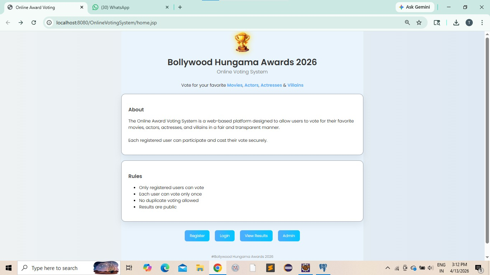
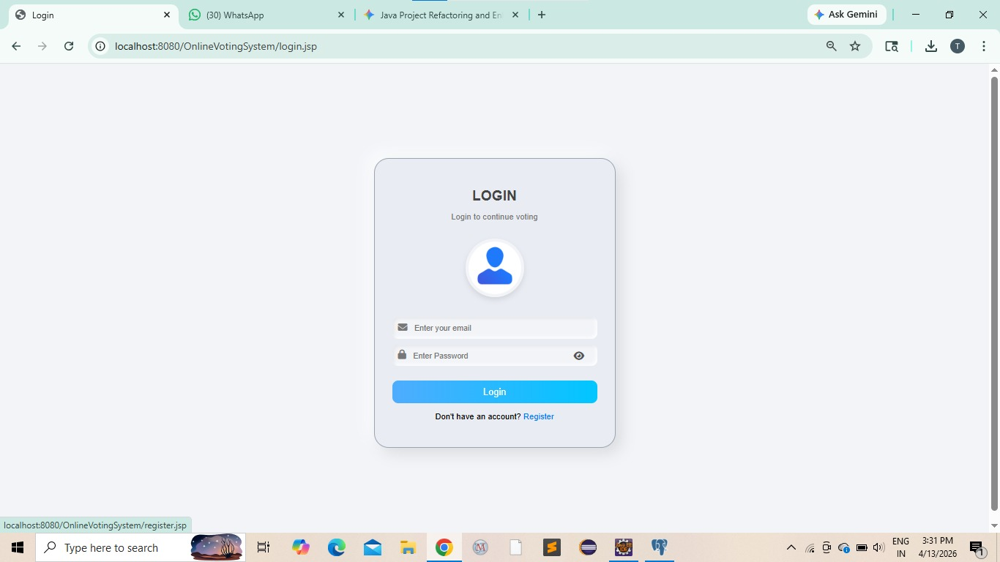
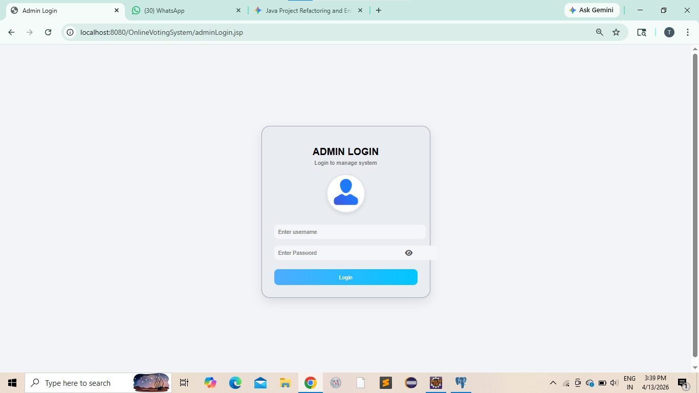
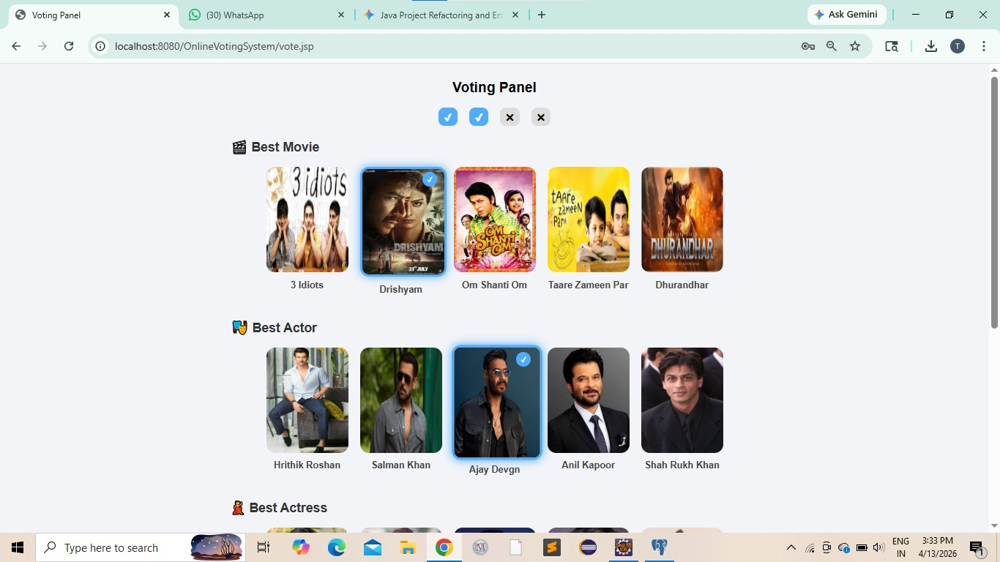
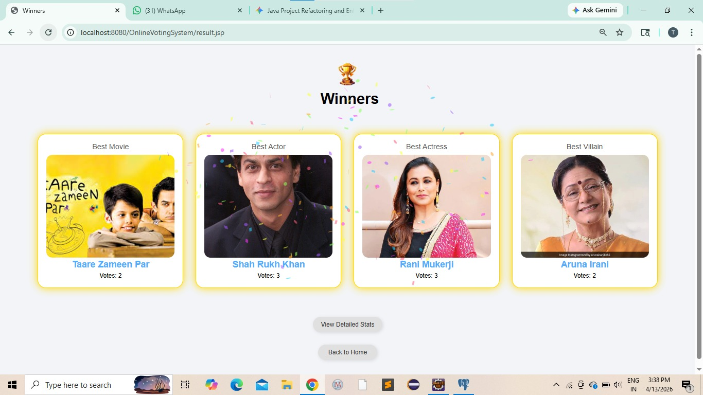
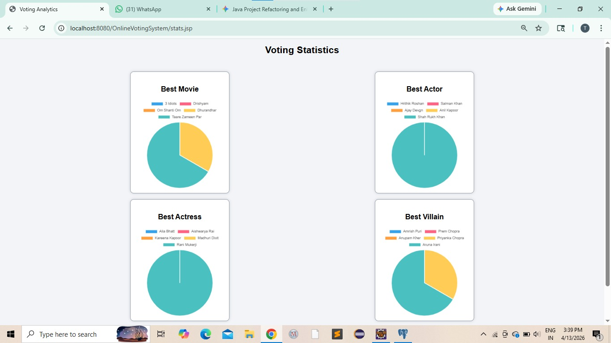
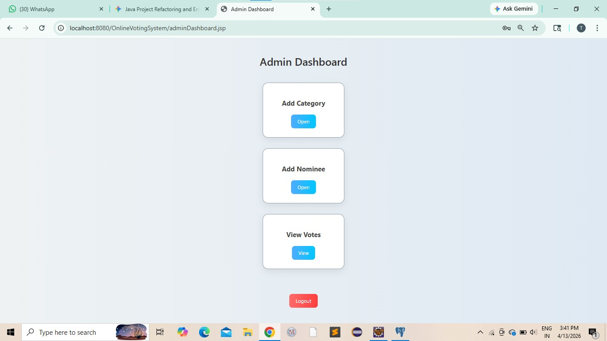
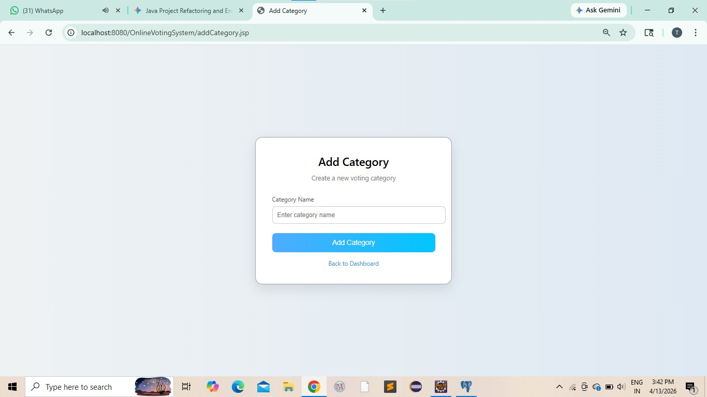
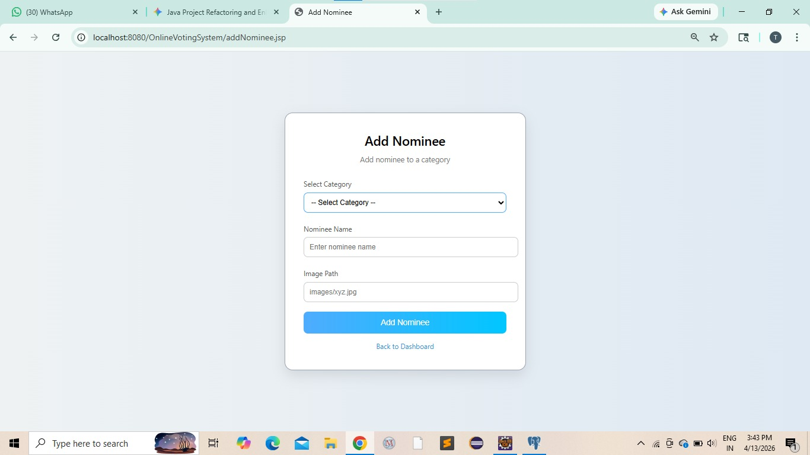

# Online Voting System

An Online Voting System developed using Java, JSP, Servlets, Eclipse IDE, and PostgreSQL.

## Features
- User Registration and Login
- Online Voting System
- Admin Panel
- Vote Result Management
- Category Management
- Nominee Management
- Voting Statistics

## Technologies Used
- Java
- JSP & Servlets
- PostgreSQL
- JDBC
- Eclipse IDE
- HTML/CSS

## Modules
### User Module
- User Registration
- User Login
- Vote Casting
- View Results

### Admin Module
- Admin Login
- Add Categories
- Add Nominees
- View Voting Statistics
- Manage Voting Panel

## How To Run Project

1. Import project into Eclipse IDE
2. Install PostgreSQL
3. Create database in PostgreSQL
4. Configure database connection in `DBConnection.java`
5. Run project on Apache Tomcat Server
6. Open browser and run application

## Developed By
Tanaya Wani

---

# Project Screenshots

## Home Page

## User Registration

## User Login

## Admin Login

## Voting Panel

## Result Page

## Voting Statistics

## Admin Dashboard

## Add Category

## Add Nominee

